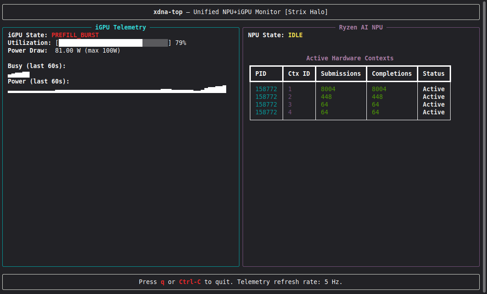

<div align="center">

# `xdna-top`

**The missing system monitor for AMD Ryzen AI NPUs.**

Unified, real-time NPU + iGPU telemetry for Strix Halo — in your terminal,
where `amd-smi` comes up empty.

[](LICENSE)
[](pyproject.toml)
[](docs/HOW-IT-WORKS.md)
[](#roadmap)

</div>

<div align="center">



[Interactive telemetry dashboard](https://boxwrench.github.io/xdna-top/)

</div>


---

## Why this exists

If you run local AI on an AMD Strix Halo machine, you are flying blind twice over:

| You want to know… | `amd-smi` | `nvtop` / `amdgpu_top` | **`xdna-top`** |
|---|---|---|---|
| iGPU busy % / power on gfx1151 | `N/A` ([ROCm #6035](https://github.com/ROCm/ROCm/issues/6035)) | partial | ✅ live, from kernel sysfs |
| Is the **NPU** doing anything at all? | — | — | ✅ live contexts + activity |
| Both, side by side, while two models run | — | — | ✅ that's the whole point |

When this tool was built, the NPU half didn't exist anywhere: nothing surfaced
XDNA activity. (GNOME Resources 1.10, Feb 2026, has since added a desktop GUI
view of AMD NPUs.) `xdna-top` remains the only *terminal* monitor for it, the
only *unified* NPU + iGPU view on this silicon, and the only *per-context* one —
owning PID and live submission counters, not a single aggregate number. It reads
the NPU from AMD's own XRT (`xrt-smi`) and pairs it with iGPU telemetry scraped
directly from `sysfs` — one terminal, one glance, both engines.

Born from a practical need: while experimenting with **concurrent NPU + iGPU
local LLM inference** on Strix Halo, "is the NPU actually executing?" turned out
to be unanswerable with stock tools. So we built the answer.
*(More war stories in [docs/ORIGINS.md](docs/ORIGINS.md).)*

## What it shows — precisely

Honesty matters in a measurement tool, so here is exactly what each pane is:

- **iGPU:** `busy %` and `power (W)` read from the kernel's `amdgpu` sysfs
  endpoints at 5 Hz, with 60-second rolling sparklines. These are the same
  counters the driver itself maintains — no estimation.
- **NPU:** hardware context list from `xrt-smi examine --report aie-partitions` —
  owning PID, context ID, submission/completion counters, and an **activity
  state derived from counter deltas** (a context whose submissions are
  incrementing is doing work; an in-flight gap between submissions and
  completions means work is queued *right now*).
- What it does **not** show: an NPU "utilization %." The XDNA fabric is a
  spatial dataflow architecture: a single "compute busy" percentage isn't
  meaningful there — and on current kernels there is nothing to read anyway.
  We probed: on 6.17, `amdxdna` exposes no telemetry sysfs node at all, and
  `xrt-smi`'s Estimated Power reads N/A even mid-generation (receipts in
  [docs/bundle/](docs/bundle/)). The truthful unprivileged signal is
  per-context submission-counter deltas, so that is what we show — and explain
  in [docs/HOW-IT-WORKS.md](docs/HOW-IT-WORKS.md).

## Quick start

```bash
pip install xdna-top        # or: pipx install xdna-top
xdna-top                    # live TUI, q to quit
xdna-top --json             # one fused telemetry reading to stdout, then exit
lemonade-top                # same monitor, lemonade-stand theme 🍋
```

`lemonade-top` is the very same telemetry engine — identical NPU + iGPU signals
and `--json` output — just wearing a lemonade-stand theme. It's purely cosmetic
(no extra dependencies, nothing to do with the Lemonade SDK); pick whichever
palette you prefer.

**Requirements:** Linux with the `amdxdna` driver bound (`/dev/accel/accel0`),
Python ≥ 3.11, and `xrt-smi` on your PATH for the NPU pane. No ROCm required.
Missing a piece? The tool **degrades gracefully** — panes flag themselves as
degraded instead of crashing.

## Features

- Unified live view: both engines, one screen, 5 Hz
- Rolling ASCII sparklines for iGPU busy and power
- Per-context NPU table: PID, submissions, completions, derived activity
- `--json` mode for scripts, logging, and dashboards
- Pessimistic fallbacks everywhere — built for imperfect driver stacks
- Zero daemon, zero root*, zero ROCm dependency
  <sub>*standard sysfs/xrt permissions apply</sub>

## How it works (30 seconds)

`sysfs` supplies the iGPU's own driver counters; `xrt-smi` exposes the NPU's
hardware-context bookkeeping; `xdna-top` polls both, derives activity from
submission-counter deltas, fuses them into one reading, and renders it with
[rich](https://github.com/Textualize/rich). The full guided tour — including an
annotated real capture of an LLM generation lighting up the NPU pane — is in
**[docs/HOW-IT-WORKS.md](docs/HOW-IT-WORKS.md)**, and the hosted interactive
view lives at **[boxwrench.github.io/xdna-top](https://boxwrench.github.io/xdna-top/)**.

## Roadmap

- [ ] Real screenshot + asciinema demo (v0.1)
- [ ] Hosted telemetry chart gallery (GitHub Pages)
- [ ] Configurable poll rate / history window
- [ ] Per-context history view
- [ ] More APUs (Phoenix/Hawk Point XDNA1) — testers welcome

## Contributing

Issues and PRs welcome — especially captures from other Ryzen AI machines.
Read [CONTRIBUTING.md](CONTRIBUTING.md) first; the one house rule is
**claims precision**: docs never promise a signal the hardware doesn't give.

## License & citation

Apache-2.0 © Keith. If this tool helped your research, see
[CITATION.cff](CITATION.cff).
