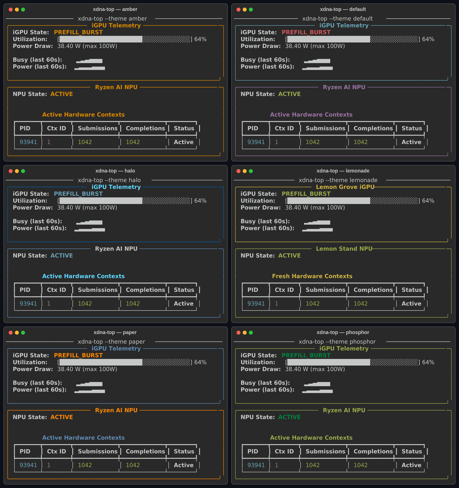

# Themes

`xdna-top` ships a small registry of TUI themes. A theme only changes colors,
borders, header/footer chrome, and header art. It never renames or hides a
metric, state, unit, counter, or measured value, so a screenshot in any theme
stays claims-accurate.

## Using a theme

```bash
xdna-top --list-themes                # print available theme names
xdna-top --theme phosphor             # pick a theme for this run
XDNA_TOP_THEME=halo xdna-top          # or set a default via the environment
```

Resolution order is `--theme` > `XDNA_TOP_THEME` > the entry point's default
(`default` for `xdna-top`, `lemonade` for `lemonade-top`). An unknown `--theme`
name exits non-zero and lists the valid names. `lemonade-top` remains a
compatibility alias: it defaults to the `lemonade` theme but still honors
`--theme` and `XDNA_TOP_THEME`.

## Available themes



| Name | Look |
|---|---|
| `default` | cyan/magenta on the standard terminal palette |
| `lemonade` | lemonade-stand yellow/green with a pixel-lemon header |
| `paper` | high-contrast, colorblind-safe blue/orange for docs and print |
| `phosphor` | green monochrome CRT terminal |
| `amber` | amber monochrome CRT terminal |
| `halo` | deep navy and silver |

The gallery above is rendered with illustrative values to show each palette. It
stacks the two sample panels for compact documentation and does not depict a
selectable live TUI layout. The live TUI remains side by side; metric columns,
units, state values, and numbers are identical across all themes.

## Contributing a theme

Themes are intentionally low-risk, data-only additions and make good first
contributions.

1. In `src/xdna_top/main.py`, add a `TuiTheme` built with
   `dataclasses.replace(DEFAULT_THEME, ...)`, overriding only color, border,
   style, and header/footer fields. Keep the accurate pane titles unless the
   theme is an explicitly playful one like `lemonade`.
2. Register it in the `THEMES` dict under a short lowercase name.
3. Use only [Rich-valid color names](https://rich.readthedocs.io/en/stable/appendix/colors.html).
   The theme test suite renders every registered theme, so an invalid color name
   fails tests.
4. Do not change anything outside cosmetics. The claims-accuracy test asserts that
   every theme still renders the `PID`, `Submissions`, `Completions`, and `Status`
   columns, the units, the state values, and the observed numbers. A theme that
   renamed or hid a metric would fail that test.

Candidate themes still open (see [ROADMAP.md](ROADMAP.md)): `fabric` (teal
tile-grid), `team-red`, `lime`, and `grapefruit`.
